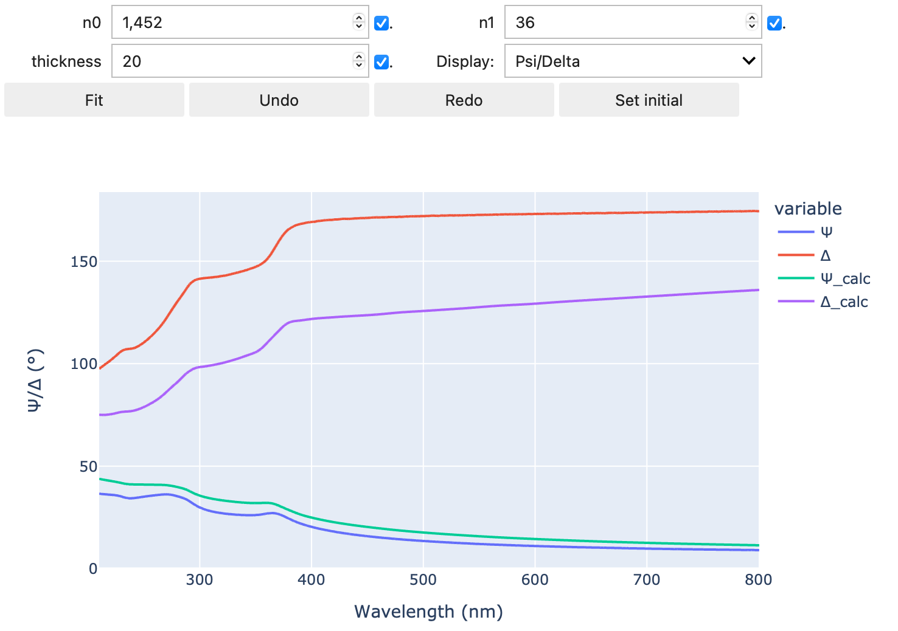

# Summary

PyElli is an open source analysis tool for linear optical interaction of layered materials written in python.
It mainly targets spectroscopic ellipsometry, but is easily adaptable to various transmission and reflection experiments.

Spectroscopic ellipsometry (SE) is used throughout various scientific fields to determine the optical constants of layered material stacks.
SE experiments do not yield directly usable data. To deduce actual material parameters from an SE experiment, numerical analysis needs to be performed.
This is typically done with the transfer-matrix method (tmm), which associates an interaction matrix to the optical response of each material layer. The full optical response of a material system is then determined by matrix multiplication of the layers matrices.

Proprietary software for such analysis is mostly shipped with ellipsometers, where each ellipsometer manufacturer supplies their own adapted version.
While this is great for a laboratory workflow, it ties scientists to the optical models and experiments available in the software, is hard to reproduce with other systems and makes data interchange cumbersome.
If software does not support a specific kind of analysis, e.g., calculating anisotropic materials or simultaneous fitting of external experimental parameters, scientists need to use third party software.

PyElli offers an open source alternative to existing solutions while staying as compatible as possible.
This allows scientist to adapt pyElli to their needs, either for custom experiments not covered by other software [@eberheim2022] or as a full FAIR data [@Wilkinson2016] analysis pipeline for SE measurements.
It is designed with extensibility and adaptability in mind, to allow scientists to easily develop their custom analysis pipelines.
It also serves the need of FAIR data by supporting recent advances in standardization of ellipsometry data and models.

The optical models used, try to stay as close as possible to literature [@Hilfiker2018].
It is possible to add new dispersions as code or use a generic formula dispersion, which is able to parse a text-based formula into a fittable dispersion.

To analyse materials it is helpful to have a database of pre-defined models to use.
For this purpose, pyElli includes the popular public domain database for optical constants [refractiveindex.info](https://refractiveindex.info) [@rii], which allows users to load literature dispersions with a single line of code.

PyElli supports using multiple solving algorithms, which allows for specialized applications.
Currently, two algorithms using different formulations are available.
The first one is a simple algorithm based on a 2x2 matrix formulation [@byrnes2020multilayer] and the second one a more complex 4x4 formulation [@Berreman72].
While the 2x2 algorithm splits the light into two perpendicular polarized beams and solves them separately, the 4x4 matrix approach solves the complete electromagnetic field, which allows solving more complex problems, e.g., anistropic materials or active media.

For fast processing pyElli's algorithms are fully vectorized for multiple wavelengths and leverage the numerical algebra libraries [NumPy](https://numpy.org) [@harris2020array] and [SciPy](https://scipy.org) [@2020SciPy-NMeth].
This allows the usage of advanced fitting algorithms, i.e., global optimizers, in reasonable evaluation times and enables embedded in-situ monitoring of overlayer growth [@hauptmann2023].
The usage of python and vectorization libraries allows for easy adoption of artificial intelligence based analysis of SE data.

# Statement of need

The importance of publishing data according to the FAIR principles [@Wilkinson2016] is growing.
Many research journals already require authors to add supporting data and sponsors are starting to demand data governance from institutes and researchers.
Since not only the data itself is necessary to reproduce data, but also the software the data was created with, the FAIR principles were recently extended to apply to research software, too [@Barker2022].
We believe that producing FAIR data and using a FAIR and open analysis pipeline is especially important for SE as the results are tightly related and dependent on the algorithms and models used for evaluation.

An open source toolkit has many inherent benefits over proprietary software.
For SE the optical models vary between manufacturers and the translation may be difficult, if clear documentation is not available.
PyElli's open source nature makes optical models extendable, auditable and occurring changes comprehensible.
Each version of pyElli is associated a doi and a zenodo upload, which allows for reliable referencing and reproducing of analysis results.
It supports [NXellipsometry](https://fairmat-experimental.github.io/nexus-fairmat-proposal/9636feecb79bb32b828b1a9804269573256d7696/classes/contributed_definitions/NXellipsometry.html#nxellipsometry), a recent advancement in standardization of SE data.
The standard is developed by the german consortium [FAIRmat](https://www.fair-di.eu/fairmat) within the german National Research Data Infrastracture (NFDI) and is accepted by the [NeXus International Advisory Committee (NIAC)](https://www.nexusformat.org/NIAC.html), which is maintaining beamline-standards in the [NeXus format](https://www.nexusformat.org) since 20+ years [@Konnecke2015].
PyElli is also available as an [example](https://gitlab.mpcdf.mpg.de/nomad-lab/nomad-remote-tools-hub/-/tree/develop/docker/ellips/example) and a cloud-based [analysis tool](https://nomad-lab.eu/prod/v1/staging/gui/analyze/north) in the research data management software [NOMAD](https://nomad-lab.eu/nomad-lab/) [@Scheffler2022].

In summary, we believe and hope that pyElli will further contribute to easier analysis, reproducibility as well as FAIR data management within the ellipsometry community.

# Software with similar functionalities

Other notable python open source software for solving transfer-matrices are available, but tend to focus on different aspects:

- [PyGTM](https://pygtm.readthedocs.io) [@Passler17; @Passler19] provides a slower, but more extensive general transfer matrix approach. It allows to calculate additional parameters, like the local strength of the electric field in any position of the multilayer stack.
- [PyLlama](https://pyllama.readthedocs.io) [@Bay2022] is focused on the simulation of liquid crystals and uses non-vertorized TMM and a scattering matrix algorithm (rigourous coupled-wave analysis, RCWA).
- [RayFlare](https://rayflare.readthedocs.io) [@Pearce2021] is a complete toolkit to simulate physical and electrical properties of solar cells. It provides the same 2x2-algorithm[@byrnes2020multilayer] and a scattering matrix approach (S4).
- [tmm_fast](https://github.com/MLResearchAtOSRAM/tmm_fast) [@Luce22] is a fast variant of Byrnes algorithm for artificial intelligence based analysis of multilayer stacks.
- Additional mentions:
  - [refellips](https://refellips.readthedocs.io/en/latest/)
  - [EMpy](http://lbolla.github.io/EMpy/)
  - [dtmm](https://github.com/IJSComplexMatter/dtmm)
  - [py_matrix](https://github.com/gevero/py_matrix)

# Example: Building a simple model

Building an optical model in pyElli is simple and straightforward.
Here, we will show the process by creating a standard model for SiO2 on Si.
We will use a cauchy dispersion function for SiO2 and tabulated literature values for Si loaded from the refractiveindex.info database.

Before we dive into building the model, we need to import the necessary libraries.
PyElli is imported from the module `elli` and here we want to use our parameters wrapper `ParamsHist`, which is imported from `elli.fitting`. `ParamsHist` is a wrapper around the `Parameters` class from [lmfit](https://lmfit.github.io/lmfit-py/index.html) [@matt_newville_2023_7810964], adding history to it. This way you can revert your model to an earlier set of parameters.
We also import `linspace` from `numpy`, which we'll need for generating a wavelength axis.

```python
from numpy import linspace
import elli
from elli.fitting import ParamsHist, fit
```

First, we instantiate the paramters.
We only need `n0` and `n1` for SiO2, so we keep all other values to default, which is zero in this case.
Additionally, we introduce the thickness of SiO2 in nanometers.
Here, you may also add additional settings for lmfit parameters.
For a list of parameter arguments you may refer to lmfit's documentation or consult our verbose [basic example](https://pyelli.readthedocs.io/en/stable/auto_examples/plot_01_basic_usage.html#sphx-glr-auto-examples-plot-01-basic-usage-py).

```python
params = ParamsHist()
params.add("n0", value=1.452)
params.add("n1", value=36.0)
params.add("thickness", value=20)
```

Now, the cauchy model is created by using the `Cauchy` class.
Each dispersion has it's own class and you'll find a list of different dispersions in our [documentation](https://pyelli.readthedocs.io/en/stable/dispersions.html).
It is important to note that there are two types of parameters for dispersions.
**Single parameters**, which only appear once in the formula, e.g., `n0` and `n1` are single parameters and **repeated parameters** which represent one element of a sum and may be used in an setwise arbitrary amount.
Single parameters are added to the class constructor, like `Cauchy(param1, ...)` and repeated parameters are added via the `.add(...)` method, like `Sellmeier().add(A=param_a, B=param_b)`.
The available single and repeated parameters are listed in the documentation for each dispersion.
We are using a cauchy model here, which only takes single parameters.
Therefore, we pass all parameters to the class constructor.
Subsequently, the `.get_mat()` function is called on the created object to automatically convert the dispersion into an isotropic material.

```python
SiO2 = elli.Cauchy(
  params["n0"],
  params["n1"],
).get_mat()
```

To request tabulated literature values for silicon, we instantiate the refractiveindex.info database and query it for the material (`Si`) and author (`Aspnes`).
It is possible to search the database first to get a list of matching entries.
See the [documentation](https://pyelli.readthedocs.io/en/stable/database.html) for details.

```python
rii_db = elli.db.RII()
Si = rii_db.get_mat("Si", "Aspnes")
```

With all materials instantiated, we are able to build the layered structure.
The class `Structure` takes three arguments:

- The incident half-space, this is air in most cases.
- The layer stack as an array of `Layer` objects. Typically, the `Layer` object is created by adding the material and the thickness of the layer.
- The lower half-space, this is typically the substrate.

The incident and lower half-space are modeled as infinite to terminate the calculation.
Therfore, no backside scattering will be introduced into the calculation.
As for most SE experiments, the incident half-space will be air and the lower half-space an opaque substrate.

```python
structure = elli.Structure(
    elli.AIR,
    [elli.Layer(SiO2, params["thickness"])],
    Si,
)
```

Eventually, everything left to do is triggering a calculation with calling `evaluation(...)` on the structure.
We use a `wavelengths` array from $210\;nm$ to $800\;nm$ for the calculation range and an angle of incidence of $70$ degree (second parameter of evaluate).

```python
wavelengths = np.linspace(210, 800, 100)
result = structure.evaluate(wavelengths, 70)
```

The calculation is stored in the `result` variable, which is an [`Result` object](https://pyelli.readthedocs.io/en/stable/result.html).
This objects holds all input paramters and the calculation results. You simple can call `psi`, `delta`, `R`, etc. to get your desired output.
We may also use the `@fit` decorator in `elli.fitting` to automatically show a widget-based fitting gui for jupyter notebooks.
Figure \autoref{fig:fit_dec_example} shows the output when used with this example model and some experimental data.

You find additional information on how this is done in our [examples](https://pyelli.readthedocs.io/en/stable/auto_examples/index.html).

# Acknowledgements

M.J.M. acknowledges financial support by the Deutsche Forschungsgemeinschaft (DFG, German Research Foundation), grant No. 398143140 (FOR 2824).

We thank Olivier Castany and Céline Molinaro for their implementation of the Berreman formalism, Steven J. Byrnes for his 2x2 transfer-matrix-method and Mikhail Polyanskiy for curating the refractiveindex.info database.

# References

<!-- Citations to entries in paper.bib should be in
[rMarkdown](http://rmarkdown.rstudio.com/authoring_bibliographies_and_citations.html)
format.

If you want to cite a software repository URL (e.g. something on GitHub without a preferred
citation) then you can do it with the example BibTeX entry below for @fidgit.

For a quick reference, the following citation commands can be used:

- `@author:2001` -> "Author et al. (2001)"
- `[@author:2001]` -> "(Author et al., 2001)"
- `[@author1:2001; @author2:2001]` -> "(Author1 et al., 2001; Author2 et al., 2002)" -->
