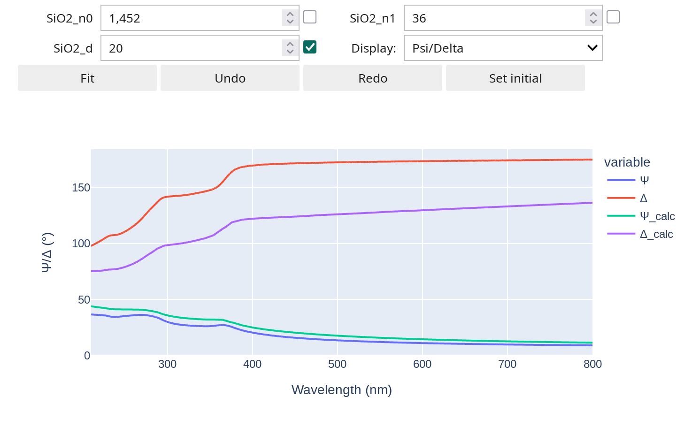

# Summary

PyElli is an open-source Python-based analysis tool for the linear optical interaction of layered materials.
The code primarily targets spectroscopic ellipsometry (SE) but is adaptable to various transmission and reflection experiments featuring spectral and polarization resolution.

Various scientific fields use SE to determine the optical constants of materials and layered material stacks.
The as-measured SE experimental requires numerical analysis to deduce commonly used, physically meaningful material parameters.
A typical approach uses transfer-matrix methods (TMM) [@tompkins2005, @WVASEguide].
Here, an interaction matrix describes the optical response of each individual material layer.
The full optical response of a multilayer system is then determined by matrix multiplication of the layers' matrices.

The ellipsometer hardware typically supports bundled proprietary software solutions for such analyses.
Unfortunately, each manufacturer supplies their own adapted tools.
This promises efficient laboratory workflows if working flawlessly.
However, it binds scientists to specific optical models and experiments available in the provided software.
Furthermore, data interchange is cumbersome, and results may be hard to reproduce on competitive systems due to the use of other models or parameters.
Finally, limitations of the bundled software may stimulate scientists to use third-party software.
For example, bundled software packages may not support specific kinds of analyses, such as including the response of optically anisotropic materials or simultaneous fitting of external experimental parameters.

PyElli offers an open-source alternative extending the capabilities of existing solutions, while aiming to remain as compatible as possible:
By providing importers for various manufacturers (Woollam VWASE, Woollam CompleteEASE, Sentech, Accurion), and having dispersion models

Typical examples are implementations of custom experimental geometries not covered by other software [@eberheim2022] or as a full FAIR data [@Wilkinson2016] automated analysis pipeline for SE measurements.
The code is designed with extensibility and adaptability in mind, enabling scientists to easily develop custom analysis pipelines.
PyElli also supports recent advances in the standardization of ellipsometry data and models, addressing the need for FAIR data.

PyElli aims to provide straight-forward availability of a database of predefined dispersion models for analyzing materials.
All optical models adhere closely to the literature [@Hilfiker2018].
Also, the software easily includes the popular public-domain database for optical constants [refractiveindex.info](https://refractiveindex.info) [@rii].
This allows the inclusion of literature dispersions with a single line of code.
Additional dispersion relations can be either hard coded, which is more efficient, or parsed from a text-based domain-specific language into a fittable dispersion.

PyElli supports multiple solving algorithms with different characteristics.
Currently, two algorithms using different formulations are available: a fast algorithm based on a 2x2 matrix formulation [@byrnes2020multilayer] and a more complex 4x4 formulation [@Berreman72; @castany].
The 2x2 algorithm divides the light into two perpendicular linearly polarized beams, which are solved separately.
This, for example, eliminates the possibility of including birefringent materials.
The 4x4 matrix approach solves Maxwell's equations.
These equations describe the complete electromagnetic field inside each layer of the sample and couple this together using a matrix formalism.
This allows finding solutions to more complex problems, such as anisotropic materials, active media, or magneto-optic samples.

PyElli's ensures fast processing through fully vectorized algorithms for multiple wavelengths and by leveraging numerical algebra libraries like [NumPy](https://numpy.org) [@harris2020array] and [SciPy](https://scipy.org) [@2020SciPy-NMeth].
Together, these runtime advantages enable the practical use of advanced fitting algorithms such as global optimizers while maintaining reasonable evaluation times.
Intriguingly, such advantages enable embedded in-situ monitoring and real-time data analysis of overlayer growth.
Thus, the use of Python and vectorization libraries also facilitates the adoption of artificial intelligence-based analysis of SE data.

# Statement of need

The importance of publishing data according to the FAIR principles [@Wilkinson2016] is growing.
Many research journals already require authors to add supporting data, and there is a growing expectation from sponsors for institutes and researchers to implement data governance.
Since reproducing data requires not only the data itself but also the software used to create it, the FAIR principles have recently been extended to apply to research software as well[@Barker2022].
We believe that producing FAIR data and using a FAIR and open analysis pipeline is especially important for SE, as the results are tightly related and dependent on the algorithms and models used for evaluation.

An open-source toolkit has many inherent benefits over proprietary software.
For SE, optical models vary between manufacturers, and translation can be difficult without clear documentation.
PyElli's open-source nature makes optical models extendable, auditable, and comprehensible.
Each version of PyElli is associated with a DOI and a Zenodo upload, allowing for reliable referencing and reproducibility of analysis results.
It supports [NXellipsometry](https://fairmat-experimental.github.io/nexus-fairmat-proposal/9636feecb79bb32b828b1a9804269573256d7696/classes/contributed_definitions/NXellipsometry.html#nxellipsometry), a recent advancement in SE data standardization.
This standard is developed by the German consortium [FAIRmat](https://www.fair-di.eu/fairmat) within the German National Research Data Infrastructure (NFDI) and is accepted by the [NeXus International Advisory Committee (NIAC)](https://www.nexusformat.org/NIAC.html), which has been maintaining beamline standards in the [NeXus format](https://www.nexusformat.org) for over 20 years [@Konnecke2015].
PyElli is also available as an [example](https://gitlab.mpcdf.mpg.de/nomad-lab/nomad-remote-tools-hub/-/tree/develop/docker/ellips/example) and a cloud-based [analysis tool](https://nomad-lab.eu/prod/v1/staging/gui/analyze/north) in the research data management software [NOMAD](https://nomad-lab.eu/nomad-lab/) [@Scheffler2022].

In summary, we believe and hope that PyElli will contribute to easier analysis, reproducibility, and FAIR data management within the ellipsometry community.

# Software with similar functionalities

Other notable Python open-source software for solving transfer-matrices is available, but tends to focus on different aspects:

- [PyGTM](https://pygtm.readthedocs.io) [@Passler17; @Passler19] provides an non-vectorized, extensive general transfer matrix approach. It allows calculation of additional parameters, like the local strength of the electric field at any position in the multilayer stack.
- [PyLlama](https://pyllama.readthedocs.io) [@Bay2022] focuses on the simulation of liquid crystals and uses non-vectorized TMM and a scattering matrix algorithm (rigorous coupled-wave analysis, RCWA).
- [RayFlare](https://rayflare.readthedocs.io) [@Pearce2021] is a complete toolkit to simulate the physical and electrical properties of solar cells. It provides the same 2x2 algorithm[@byrnes2020multilayer] and a scattering matrix approach (S4).
- [tmm_fast](https://github.com/MLResearchAtOSRAM/tmm_fast) [@Luce22] is a vectorized variant of Byrnes' algorithm for artificial intelligence-based analysis of multilayer stacks.
- Additional mentions:
  - [refellips](https://refellips.readthedocs.io/en/latest/)
  - [EMpy](http://lbolla.github.io/EMpy/)
  - [dtmm](https://github.com/IJSComplexMatter/dtmm)
  - [py_matrix](https://github.com/gevero/py_matrix)

# Example: Building a model for an oxide layer on silicon

Building an optical model in PyElli is straightforward.
Here, we will demonstrate by creating a standard model for SiO$_2$ on Si.
We will use a Cauchy dispersion function for SiO$_2$ and tabulated literature values for Si loaded from the refractiveindex.info database.

We need to import the necessary libraries before building the model:
PyElli is imported from the module `elli`, and we want to use our parameters wrapper `ParamsHist`, which is imported from `elli.fitting`. `ParamsHist` is a wrapper around the `Parameters` class from [lmfit](https://lmfit.github.io/lmfit-py/index.html) [@matt_newville_2023_7810964], adding history to it so you can revert your model to an earlier set of parameters.
We also import `linspace` from `numpy` for generating a wavelength axis.

```python
from numpy import linspace
import elli
from elli.fitting import ParamsHist, fit
```

Initially, we define the fit parameters.
The Cauchy model for SiO$_2$ is defined by the `SiO2_n0` and `SiO2_n1` parameters, along with its layer thickness measured in nanometers.
Here, additional settings for lmfit parameters like constraints or bounds might be added.
For a list of parameter arguments, refer to lmfit's documentation or consult our verbose [basic example](https://pyelli.readthedocs.io/en/stable/auto_examples/plot_01_basic_usage.html#sphx-glr-auto-examples-plot-01-basic-usage-py).

```python
params = ParamsHist()
params.add("SiO2_n0", value=1.452)
params.add("SiO2_n1", value=36.0)
params.add("SiO2_thickness", value=20)
```

Now, the Cauchy model is created using the `Cauchy` class and the defined parameters.
All other Cauchy coefficients are kept at their default value of zero in this particular case.
Each dispersion has its own class, and you'll find a list of different dispersions in our [documentation](https://pyelli.readthedocs.io/en/stable/dispersions.html).
Subsequently, the `.get_mat()` method is called on the created object to automatically convert the dispersion into an isotropic material.

```python
SiO2 = elli.Cauchy(
  params["SiO2_n0"],
  params["SiO2_n1"],
).get_mat()
```

To request tabulated literature values for silicon, we instantiate the refractiveindex.info database and query it for the material (`Si`) and author (`Aspnes`).
It is possible to search the database first to get a list of matching entries.
See the [documentation](https://pyelli.readthedocs.io/en/stable/database.html) for details.

```python
rii_db = elli.db.RII()
Si = rii_db.get_mat("Si", "Aspnes")
```

With all materials instantiated, we can build the layered structure.
The `Structure` class takes three arguments:

- The incident half-space, which is typically air.
- The layer stack as a list of `Layer` objects. The `Layer` object is created by adding the material and the layer thickness.
- The lower half-space, which represents the substrate.

The incident and lower half-space are modeled as infinite to terminate the calculation.
Therefore, backside scattering of the substrate cannot be introduced into the calculation.

```python
structure = elli.Structure(
    elli.AIR,
    [elli.Layer(SiO2, params["SiO2_thickness"])],
    Si,
)
```

Finally, we trigger a calculation by calling the `evaluate(...)` method of the `structure` object.
We use a `wavelengths` array from $210$ nm to $800$ nm for the calculation range and an angle of incidence of $70°$ degree (second parameter of evaluate).

```python
wavelengths = np.linspace(210, 800, 100)
result = structure.evaluate(wavelengths, 70)
```

The calculation is stored in the `result` variable, which is a [`Result` object](https://pyelli.readthedocs.io/en/stable/result.html).
This object can hold all input parameters and the calculation results. You can call methods like `psi`, `delta`, `R`, etc., to get your desired output.
We can also use the `@fit` decorator in `elli.fitting` to automatically show a widget-based fitting GUI for Jupyter notebooks.
Figure \autoref{fig:fit_dec_example} shows the output when used with this example model and some experimental data.



You find additional information on how this is done in our [examples](https://pyelli.readthedocs.io/en/stable/auto_examples/index.html).

# Acknowledgements

M.J.M. acknowledges financial support by the Deutsche Forschungsgemeinschaft (DFG, German Research Foundation), grant No. 398143140 (FOR 2824).

We thank Olivier Castany and Céline Molinaro for their implementation of the Berreman formalism, Steven J. Byrnes for his 2x2 transfer-matrix-method and Mikhail Polyanskiy for curating the refractiveindex.info database.

# References

<!-- Citations to entries in paper.bib should be in
[rMarkdown](http://rmarkdown.rstudio.com/authoring_bibliographies_and_citations.html)
format.

If you want to cite a software repository URL (e.g. something on GitHub without a preferred
citation) then you can do it with the example BibTeX entry below for @fidgit.

For a quick reference, the following citation commands can be used:

- `@author:2001` -> "Author et al. (2001)"
- `[@author:2001]` -> "(Author et al., 2001)"
- `[@author1:2001; @author2:2001]` -> "(Author1 et al., 2001; Author2 et al., 2002)" -->
